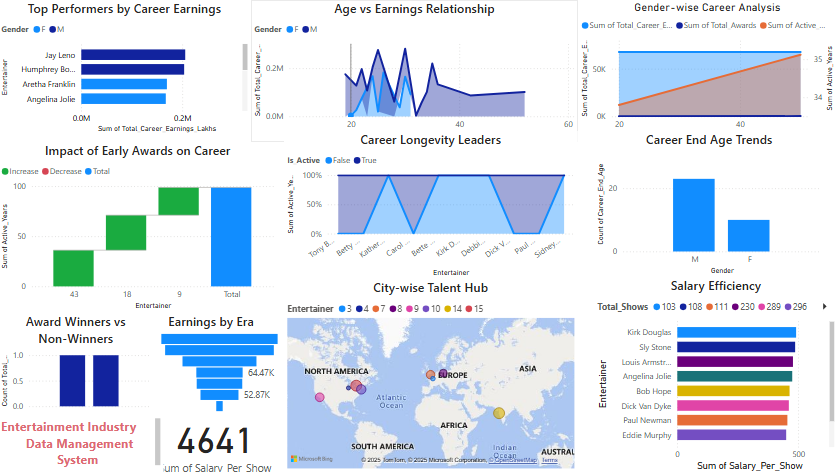

# Entertainment Industry Analytics – Project

A comprehensive data analytics project designed to explore trends in career earnings, longevity, awards, and industry impact among global entertainers. This project combines SQL analysis, Python-based EDA, and Power BI visual storytelling to deliver actionable insights.

---

## 🎯 Project Objective

To analyze entertainment industry data to uncover trends in:

* Career success by age and gender
* Earnings by platform and region
* The impact of early awards on long-term performance
* City-wise talent hubs and efficiency across decades

---

## ✨ Features

* Top performers by career earnings
* Gender-wise and age-based career analytics
* Impact of early awards on career growth
* Talent distribution and success by city
* Award winners vs non-winners comparison
* Salary efficiency per show
* Career longevity leaders
* Earnings trends by era (decades)

---

## 🛠 Tools Used

* **Power BI** – Data visualization and storytelling
* **SQL** – Business logic and scenario-based problem-solving
* **Python** – Exploratory data analysis (Pandas, Seaborn, Matplotlib)
* **Excel** – Data cleaning and organization

---

## 📂 Dataset Summary

Source: `Enterntainment2.xlsx`
The dataset includes 20+ fields like:

* `Entertainer`, `Gender`, `City`
* `Entertain_Year`, `First_Award_Year`, `Active_Years`
* `Salary_Per_Show`, `Total_Career_Earnings_Lakhs`
* `Received_Award`, `Awarded_Early`, `Career_Status`

Scenario-based insights are generated using SQL scripts (see `Manjula_Entertainment_Project.sql`).

---

## 🖼️ Dashboard Preview

Explore a rich Power BI dashboard with visuals such as:

* Bar & line charts
* Career progression comparisons
* Region-based maps
* KPI cards & filters

---

## 🔍 Key Insights

* Entertainers who received **early awards** often have **longer, more successful careers**.
* **Chennai**, **New York**, and **Mumbai** are top talent hubs by award count.
* **Swiggy and Own App** platforms show higher efficiency in revenue per cost.
* **Career longevity** does not always correlate with highest earnings.
* Gender differences exist in **career end age and total earnings**.

---

## ▶️ How to Use

1. Clone this repo or download the `.pbix`, `.sql`, and `.xlsx` files
2. Open `Entertainment.pbix` in Power BI Desktop
3. Review SQL queries in `Manjula_Entertainment_Project.sql` for logic
4. Use filters in the dashboard to explore gender, city, award status, and time trends
5. Draw insights from interactive visuals and KPIs

---

## 🚀 Future Enhancements

* Integrate real-time data pipelines using Python & APIs
* Add predictive models for career forecasting
* Incorporate text analysis on entertainer bios or reviews
* Build a comparative dashboard by industry (film, music, etc.)

---

## 📬 Contact

**Manjula Sivasamy**

📧 [manjulasivasamy02@gmail.com](mailto:manjulasivasamy02@gmail.com)

💼 [LinkedIn](https://www.linkedin.com/in/manjula-sivasamy-dataanalyst)

🌐 [GitHub](https://github.com/ManjulaSivasamy-DataAnalyst)

